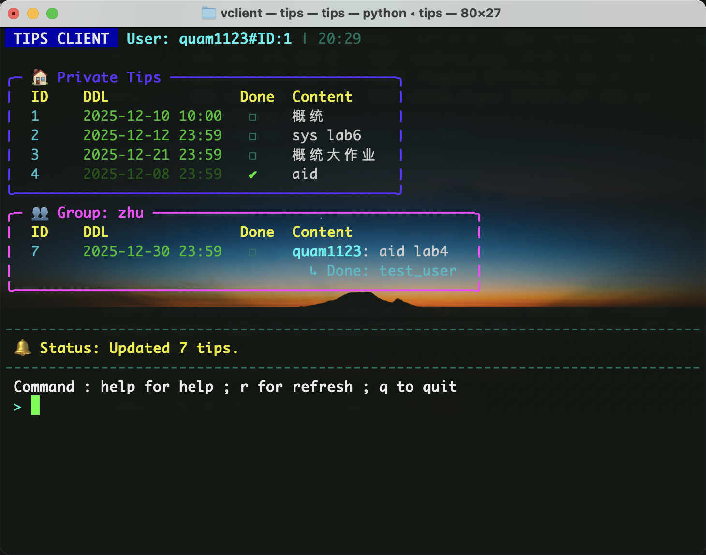

# tips_client
这是 tips 应用的前端，tips 应用采用了fastapi + MySql 作为后端，使用Requests库与后端进行通信。

前端基于命令行界面，使用Rich库进行美化

## 运行环境

目前仅支持在 Linux 和 MacOS 平台运行。Contributor community 正在考虑后续兼容 Windows 平台。

## 安装步骤
1. 克隆代码库到本地


2. 进入代码目录
``` bash
cd tips_client
```
3. 运行安装脚本
``` bash
chmod +x install.sh
./install.sh
```

4. 注册帐号（若已有帐号可跳过此步）
``` bash
tips --signup
```

## 使用方法
现在tips就集成到你的系统中了，可以使用 `tips` 命令来启动它。

## 关于自动登录
版本v1.1后，允许使用自动登录了。目前仅允许**本设备**在输入一次密码后的**30天内**免密登录。

目前没有命令行办法关闭/开启/单次失效自动登录。

如果需要关闭自动登录，请将 config.py 中的 AUTO_LOGIN_FILE 设置为 `""` 。如果需要重新开启自动登录，请将 AUTO_LOGIN_FILE 重新设置为一个合法的路径，并将该路径指向一个 pkl 文件。默认值为 `"/core/Auth.pkl"` 。如果需要临时取消一次自动登录，请删除 /core/Auth.pkl 后重启 `tips` 。

## demo

